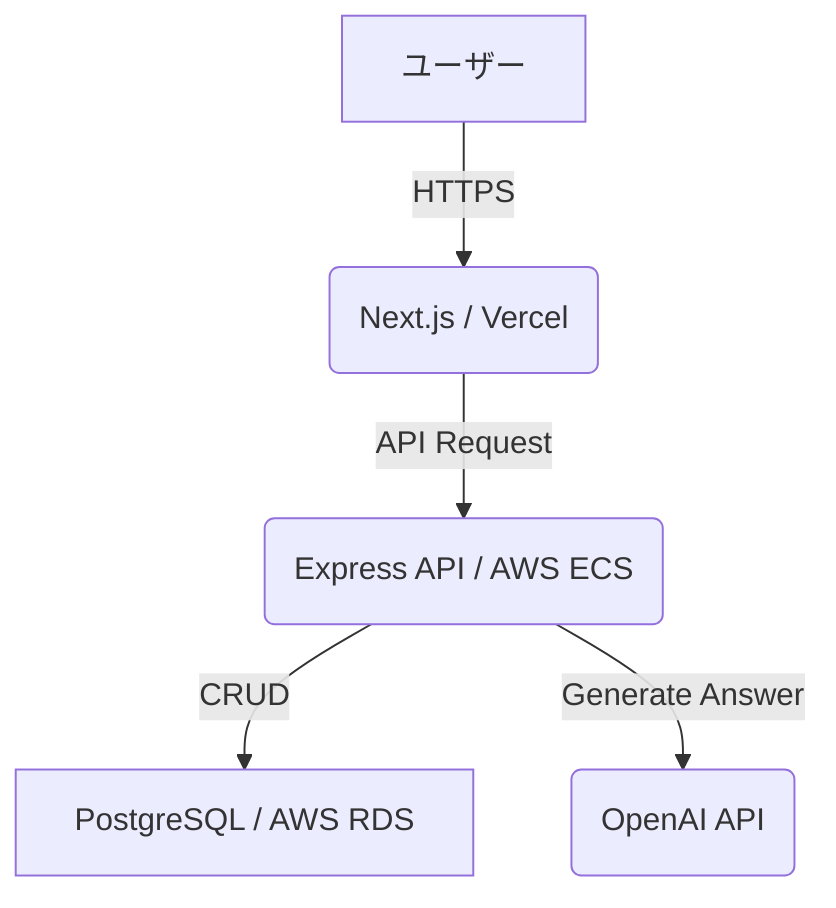

目的: システムの全体像と設計思想を伝える。「どのように作られているか」の地図を示す。
# アーキテクチャ

## 1. アーキテクチャ図


図の説明
  - ユーザーはNext.jsで構築されたフロントエンドにアクセスします。
  - フロントエンドはAWS ECS上で動作するExpress APIサーバーにリクエストを送信します。
  - APIサーバーは、データの永続化にRDS上のPostgreSQLを、回答文生成にOpenAI APIを利用します。

## 2. 設計原則 (Design Principles)
  - 原則1: シンプルさを保つ (Keep It Simple)
    - 過剰な抽象化や複雑な設計を避け、シンプルで理解しやすいコードを維持します。
  - 原則2: サーバーレスファースト
    - 可能な限りマネージドサービスを利用し、サーバー管理のオーバーヘッドを削減します。
  - 原則3: （このプロジェクトで重視する他の設計原則を記述します...）

## 3. 主要コンポーネントの責務

| コンポーネント名 | 責務・役割 |
| --- | --- |
|frontend | ユーザーインターフェースの提供。状態管理、APIとの通信。
|api-server | ビジネスロジックの実行。DB操作、外部API連携。
|database | ユーザー情報、問い合わせデータなどの永続化。
|ci-cd-pipeline | GitHub Actionsによるテスト、ビルド、デプロイの自動化。

## 4. API仕様
本プロジェクトのバックエンドAPI仕様は、プロジェクトルートにある `openapi.yaml` ファイルで定義されています。
このファイルはOpenAPI 3.0形式で記述されており、APIの全エンドポイント、データモデル、認証方法などの詳細な技術仕様を含みます。

また、`docs/02_DOMAIN_KNOWLEDGE.md` には、ビジネスロジックの観点から見たAPIの概要が記載されています。開発に着手する際は、両方のドキュメントを参照してください。

## 5. ディレクトリ構造
```
.
├── docs/               # このドキュメント群
├── packages/
│   ├── api/           # Express APIサーバーのソースコード
│   └── web/           # Next.js フロントエンドのソースコード
├── .github/            # CI/CD (GitHub Actions) の設定
└── docker-compose.yml  # ローカル開発環境の定義
```
