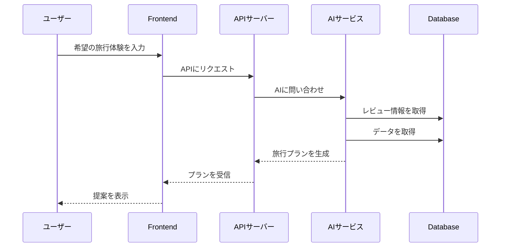
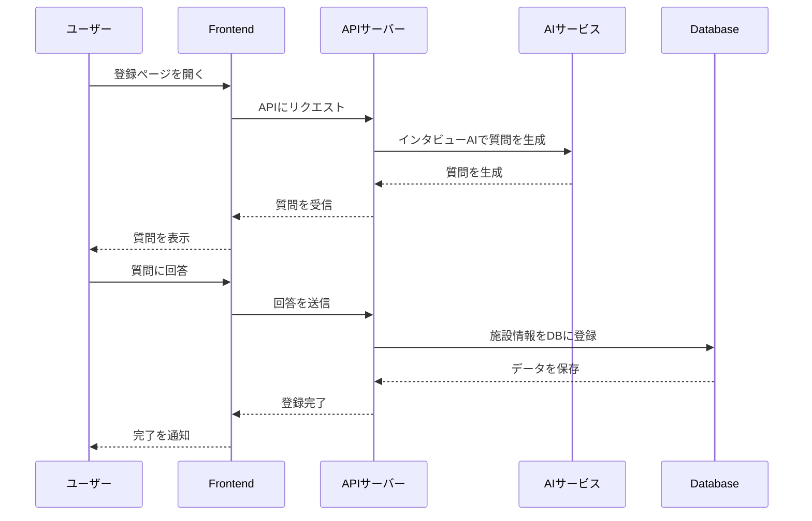
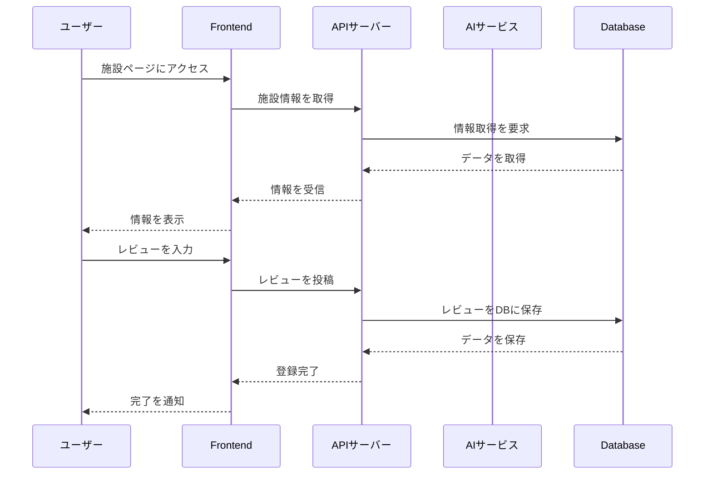

目的: システムの全体像と設計思想を伝える。「どのように作られているか」の地図を示す。
# アーキテクチャ

## 1. アーキテクチャ図

旅行プランの提案フロー

観光施設の登録フロー

レビューの投稿フロー

図の説明
  - 
## 2. 設計原則 (Design Principles)
  - OpenAPI仕様書に基づくマイクロサービス連携
    - 各サービスはOpenAPI仕様書に従い、openapi-codegen(Golang)やopenapi-typescript(TypeScript)で自動生成されたクライアントを使用して通信。

## 3. 主要コンポーネントの責務

| コンポーネント名 | 責務・役割 |
| --- | --- |
|go-backend | Goで実装されたバックエンドAPI。ユーザー認証、データ管理、ビジネスロジックを担当。 |

## 4. ディレクトリ構造
```
.
├── docs/               # このドキュメント群
├── go-backend/        # Goバックエンドのソースコード
├── .github/            # CI/CD (GitHub Actions) の設定
├── openapi.1.0.yaml  # OpenAPI仕様書
```
