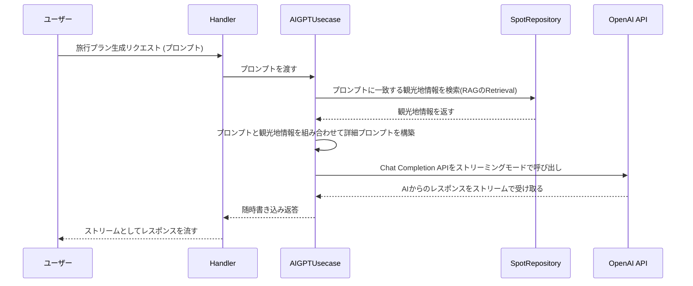

# バックエンドのアーキテクチャ

## 設計原則
1. **スキーマファースト**
  - OpenAPI仕様書をoapi-codegenでスキーマをGoコードに変換
  - sqlcでSQLクエリを型安全に扱う
2. **層化アーキテクチャ**
  - Handler, Usecase, Repositoryの3層に分割
  - 各層はInterfaceを介して疎結合に設計
3. **依存性の逆転**
  - 上位層が下位層に依存しない(下位層を入れ替え可能)ように設計
  - 具体的な実装はmain.goで組み立てる

## 使用ライブラリ
- [oapi-codegen]
  - OpenAPI仕様書からGoコードを自動生成するツール
  - `go install github.com/oapi-codegen/oapi-codegen/v2/cmd/oapi-codegen@latest` でインストール
  - `oapi-codegen --config=oapi/oapi_config.yaml ../openapi.1.0.yaml` でコードを生成
- [air]
  - Go製のホットリロードツール
  - `go install github.com/air-verse/air` でインストール
  - `air -c ./cmd/server/.air.toml` で本番環境用のホットリロード起動
  - `air -c ./cmd/inmemoryserver/.air.toml` でインメモリDBのホットリロード起動
- [sqlc]
  - SQLからGoのコードを自動生成するツール
  - `go install github.com/sqlc-dev/sqlc/cmd/sqlc@latest` でインストール
  - `sqlc generate` でコードを生成
- [golang-migrate]
  - データベースのマイグレーション管理ツール
  - `go install -tags 'postgres' github.com/golang-migrate/migrate/v4/cmd/migrate@latest` でインストール
  - `migrate create -ext sql -dir db/migration -seq <name>` でマイグレーションファイルを作成
  - `migrate -database "postgres://..." -path db/migration up` でマイグレーションを適用
  - ただし、現在はmain.goでmigrateを実行しているため、手動で実行する必要はない
## ディレクトリ構成
```plaintext
.
├── api/
│   └── server.gen.go   # 👈 OpenAPI Codegenで自動生成されたコード
├── main.go         # 👈 各パーツを組み立てて起動する役目に特化
├── internal/
│   ├── handler/        # 📦 HTTPリクエスト・レスポンスを扱う層
│   │   └── post.go
│   │   └── post_test.go
│   ├── usecase/        # 🧠 アプリケーションのビジネスロジック層
│   └── repository/     # 🗄️ データの永続化（保存・取得）を担う層
├── go.mod
└── go.sum
```
* **Handler層**
  - HTTPの世界の言葉を話します。リクエストを受け取り、Usecaseに処理を依頼し、結果をレスポンスとして返します。
* **Usecase層** 
  - アプリケーションの本体です。HTTPのことは何も知りません。「投稿を作成する」といった純粋なビジネスロジックを担当します。
* **Repository層**
  - データの保存場所です。Usecaseから依頼を受けて、メモリやデータベースにデータを保存・取得します。  

## 内部設計(アーキテクチャ)
### 1. Spot, Review, Userの基本アーキテクチャ
- 各エンティティ(Spot, Review, User)ごとにCRUD操作を提供
- HandlerからのリクエストをUsecaseが受け取り、Repositoryに処理を依頼、PostgreSQLに永続化

### 2. AIプラン生成アーキテクチャ
AIによる旅行プラン生成は、RAG (Retrieval-Augmented Generation) のアプローチを採用しています。全体的なフローは以下の通りです。

リクエスト返答のシーケンス図:


## テスト
- 各層ごとにユニットテストを実装
- 統合テストについて
  - dbなどの外部依存関係を含むテストは`//go:build integration`でビルドタグを付与して分離
  - `go test ./... -v` で統合テスト以外のテストを実行
  - `go test -tags="integration" ./... -v` で統合テスト含む全てのテストを実行
    - `docker compose up db -d`で依存関係の起動が必要
    - 考えてみれば`docker compose run --rm --build backend-dev go test -tags="integration" ./... -v`1コマンドで良いかも
- テストコードのエラーメッセージにはなるべく日本語を使用するようにします。
  - 1. チームは日本人だけ 2. テスト出力のログは日本語が目立つて見やすい

## その他
- 外部サービス依存
  - OpanAI ChatGPT API
